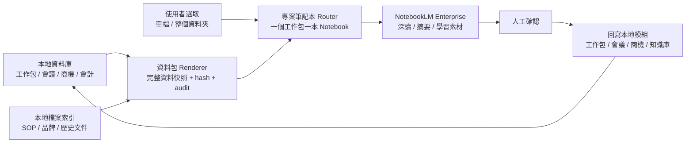

# NotebookLM 作為主知識庫的可行性評估

日期:2026-04-28
結論:不建議以 NotebookLM 作為主知識庫；建議採「本地資料庫主控 + NotebookLM 深讀副本」。

---

## 1. 結論

NotebookLM Enterprise 適合做深度閱讀、跨文件摘要、學習素材、簡報/播客草稿與研究 notebook,但不適合承擔本系統的主知識庫角色。

主知識庫仍應維持:

- 本地 MongoDB:工作包、會議、商機、會計、權限、同步紀錄。
- 本地檔案 / RAG 索引:公司知識、SOP、歷史文件、引用來源。
- NotebookLM 資料包(Source Pack):由本地資料產生、可審核、可回溯的 Markdown 快照。

功能最大化決議(2026-04-28):

- 不再以資料分級作為 NotebookLM 功能阻擋條件。
- 前端保留「完整資料 / 一般資料 / 公開資料 / 機敏資料」標記,但不因標記拒絕建立或同步。
- 同步資料包或上傳檔案時,資料會送到 NotebookLM Enterprise 雲端服務；未連線時不送出,只保留本地紀錄。
- 保留的限制只屬於技術限制:NotebookLM 官方檔案大小、source 數量、瀏覽器上傳能力、API 是否已連線。
- 使用者可直接選取單檔或整個專案資料夾上傳到 NotebookLM。

---

## 2. 官方能力與限制

可用能力:

- NotebookLM Enterprise 支援建立 notebook 與管理 source。
- Sources API 可加入文字、Google Docs/Slides、網頁、YouTube、檔案等來源。
- Enterprise 版本資料會留在 Google Cloud 專案環境中。
- 可在 Gemini Enterprise 中啟用 NotebookLM 作為搜尋來源。

關鍵限制:

- NotebookLM 是閱讀與生成工具,不是交易型資料庫。
- Gemini Enterprise 的 NotebookLM 搜尋目前偏向 notebook 搜尋/入口,不能取代本地 RAG 的細粒度權限檢索。
- NotebookLM 內的編輯或生成結果不會自然回寫本地工作包、會議、商機或會計。
- API 與部分整合仍有 Preview/Pre-GA 風險,不宜放在正式主資料流最核心。
- Source 是副本,同步頻率、權限、刪除、審計都需要本地系統補齊。

官方參考:

- NotebookLM Enterprise overview: https://docs.cloud.google.com/gemini/enterprise/notebooklm-enterprise/docs/overview
- Notebook API: https://docs.cloud.google.com/gemini/enterprise/notebooklm-enterprise/docs/api-notebooks
- Sources API: https://docs.cloud.google.com/gemini/enterprise/notebooklm-enterprise/docs/api-notebooks-sources
- Gemini Enterprise NotebookLM search source: https://docs.cloud.google.com/gemini/enterprise/docs/connect-notebooklm

---

## 3. Go / No-Go 判斷

| 面向 | 以 NotebookLM 當主知識庫 | 本地主控 + NotebookLM 副本 |
|---|---:|---:|
| 權限控管 | 中低 | 高 |
| 正式資料回寫 | 低 | 高 |
| 審計與同步紀錄 | 中低 | 高 |
| 深度閱讀體驗 | 高 | 高 |
| RAG 可測試性 | 中 | 高 |
| 多公司部署 | 中 | 高 |
| 離線/本地資料主權 | 低 | 高 |
| Agent 自動化可控性 | 中 | 高 |

判定:

- No-Go:NotebookLM 作為唯一或主要知識庫。
- Go:NotebookLM 作為資料包深讀副本。

---

## 4. 建議架構

系統原則:

- NotebookLM 不直接讀 MongoDB,但可接收使用者主動選取的單檔或整個資料夾。
- NotebookLM 不直接修改本地資料。
- 一個工作包對應一本 NotebookLM 筆記本。
- 同一工作包後續資料包、單檔、資料夾都歸入同一本筆記本。
- 資料包不再因資料等級阻擋；資料等級僅作標記。
- 同步紀錄寫入 `notebooklm_sync_runs`。
- 檔案上傳紀錄寫入 `notebooklm_file_uploads`。

本地 persistence map:

| Collection | 角色 | 是否正式資料 |
|---|---|---|
| `projects` / `memory_*` / `crm_*` / `accounting_*` | 工作包、會議、商機、會計等主資料 | 是 |
| `notebooklm_project_notebooks` | 工作包 ↔ NotebookLM 筆記本對應表 | 衍生狀態 |
| `notebooklm_source_packs` | 可審核 Markdown 資料包快照,含 hash / scope / source_entities | 衍生快照 |
| `notebooklm_sync_runs` | 每次同步嘗試、成功、失敗或未連線跳過紀錄 | 審計紀錄 |
| `notebooklm_file_uploads` | 單檔/資料夾上傳紀錄與相對路徑 | 審計紀錄 |

---

## 5. Agent 操作邊界

主管家與專家可以:

- 預覽 NotebookLM 資料包。
- 建立本地資料包。
- 查詢最近資料包。
- 在 Enterprise API 已設定時請管理員/主管家同步。

主管家與專家不可以:

- 修改 NotebookLM access token。
- 繞過本地 API 直接修改資料庫。
- 將 NotebookLM 生成內容視為正式紀錄。

已落地工具面:

- `POST /notebooklm/agent/source-packs/preview`
- `POST /notebooklm/agent/source-packs`
- `GET /notebooklm/agent/source-packs`
- `POST /notebooklm/agent/source-packs/{id}/sync`
- `POST /notebooklm/projects/{project_id}/notebook`
- `GET /notebooklm/projects/{project_id}/notebook`
- `POST /notebooklm/uploads/auto`
- `POST /notebooklm/projects/{project_id}/upload`
- `config-templates/actions/notebooklm-bridge.json`
- `config-templates/actions/internal-services.json` 已加入主管家/投標/活動/財務可用的 NotebookLM functions。

---

## 6. 驗收標準

可交付版本必須通過:

- 前端 NotebookLM 頁面清楚顯示「本地資料庫 → 資料包 → NotebookLM → 回寫本地」。
- 管理員可在前端設定 `NOTEBOOKLM_*`,access token 不回顯。
- 一般使用者可建立與預覽資料包,但不能改 Enterprise 設定。
- 未設定 Enterprise API 時,同步不送出資料,只回傳 `local_ready`。
- Agent 可透過內部 action 建立資料包。
- 測試確認資料包文案不綁定特定公司名稱。
- 文件明確寫出 NotebookLM 不是主資料庫。
